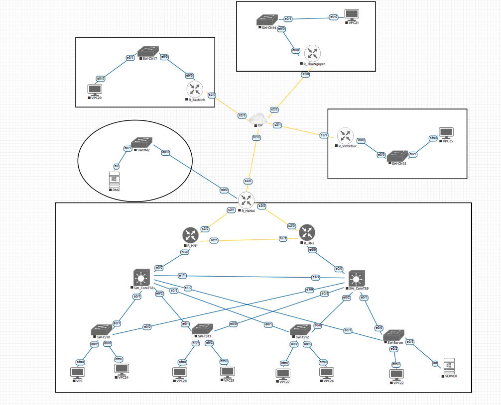

# Network-infrastructure-for-businesses
A scalable hub-and-spoke enterprise network design. It features a highly available datacenter with a redundant core, multiple remote branches connected via an ISP, and a secure DMZ with a firewall to protect public-facing services.

